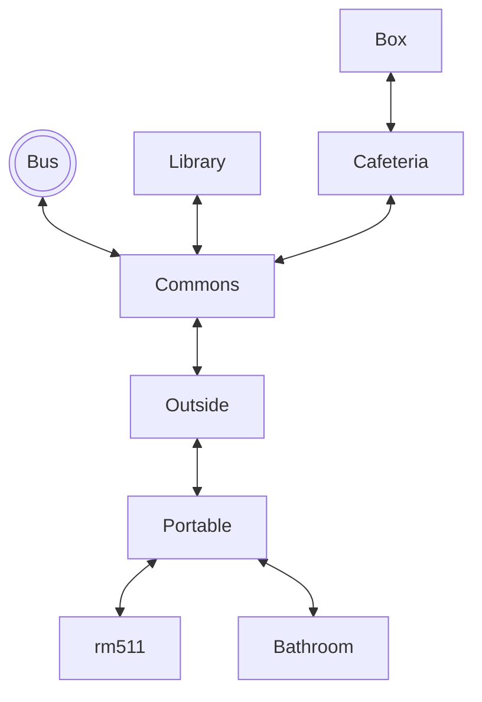

# For Goodness Cake!

## Setting

This game takes place at the Culinary Arts classroom at ACC.

## Map

The player starts on the bus, and then is directed into the Commons. T
They can explore, but must eventually make their way to rm511.

## Story

Each week in the Culinary Arts class there is a lab activity, and this week's is a decorated yellow cake! This lab will take on for 4 days:
* **Day 1:** On the first day, you will prepare your batter and bake your cake.
* **Day 2:** Since the cake has to be decorated, today will be buttercream day. You will make the buttercream to be ready to start decorating the next day.
* **Day 3:** Chef made (or bought) some fillings for the class. You get to choose the flavor of your filling and get the cake filled and crumb coated with the buttercream.
* **Day 4:** The final day is for any piping you want to do and extra decorations. Today you will get graded and get to try the cake you have made!

## Global Variables

The most important variables are
`haveCup` and `cupIsFull`, both
booleans that track progress in the
story. Depending on these two variables,
some rooms will display different things. For example, if you walk into the
library without the cup, it will prompt you to
read. If you walk in with the cup, it will show
the librarian filling the cup with coffee.

I also have numeric variables called `day` and `minute` which keep track of 
time. `minute` starts at 0 and counts up
with each move.

I have a little HUD map, and use a bunch of 
boolean variables to control which
rooms the player has discovered. A map is only displayed after the user
visits it.
